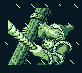
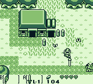
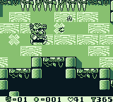
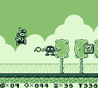

# Yet another GameBoy emulator in Rust

This is my attempt to write a GameBoy emulator in Rust, to add to the pile of existing ones.

## How to run

At the moment, you need to have the DMG boot rom file and place it under `assets/dmg_boot.bin` to be able to compile and run the emulator.

Then simply run `cargo run --release -- path/to/rom.gb`.

Current keybindings: 
- <kbd>↑</kbd>, <kbd>↓</kbd>, <kbd>←</kbd>, <kbd>→</kbd>: Joypad
- <kbd>A</kbd>, <kbd>B</kbd>: A/B
- <kbd>Enter</kbd>: Start
- <kbd>Space</kbd>: Select
- <kbd>ESC</kbd>: Exit
- <kbd>D</kbd>: interrupt the program and start the command-line debugger
- <kbd>S</kbd>: Take a screenshot

## Current status

Seems to work fine with most MBC1+RAM games that I've tried.

## Still to do
- [ ] Allow building/running without the boot rom
- [ ] Support other MBCs
- [x] Sound
- [ ] Maybe compile to WASM?

## Screenshots

