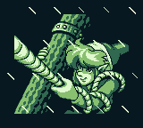
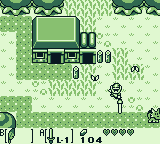
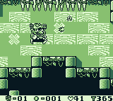
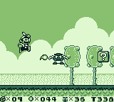

# Yet another GameBoy emulator in Rust

This is my attempt to write a GameBoy emulator in Rust, to add to the pile of existing ones.

## How to run

Simply run `cargo run --release -- path/to/rom.gb`.

By default, the game starts straight away, as if the boot ROM had just run. To run an actual boot ROM first, pass it with `--boot-rom path/to/dmg_boot.bin`. The libretro core looks for `dmg_boot.bin` in the frontend's system directory.

Current keybindings: 
- <kbd>↑</kbd>, <kbd>↓</kbd>, <kbd>←</kbd>, <kbd>→</kbd>: Joypad
- <kbd>A</kbd>, <kbd>B</kbd>: A/B
- <kbd>Enter</kbd>: Start
- <kbd>Space</kbd>: Select
- <kbd>ESC</kbd>: Exit
- <kbd>D</kbd>: interrupt the program and start the command-line debugger
- <kbd>S</kbd>: Take a screenshot

## Current status

Seems to work fine with most MBC1+RAM games that I've tried. MBC2, MBC3 (including its real-time clock) and MBC5 are supported too.

## Still to do
- [x] Allow building/running without the boot rom
- [ ] Support other MBCs (MBC1, MBC2, MBC3 and MBC5 are done)
- [x] Sound
- [ ] Maybe compile to WASM?

## Screenshots

