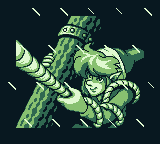
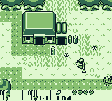
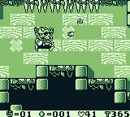
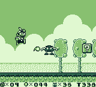

# Yet another GameBoy emulator in Rust

This is my attempt to write a GameBoy emulator in Rust, to add to the pile of existing ones.

## How to run

Simply run `cargo run --release -- path/to/rom.gb`.

By default, the game starts straight away, as if the boot ROM had just run. To run an actual boot ROM first, pass it with `--boot-rom path/to/dmg_boot.bin`. The libretro core looks for `dmg_boot.bin` in the frontend's system directory.

Current keybindings: 
- <kbd>↑</kbd>, <kbd>↓</kbd>, <kbd>←</kbd>, <kbd>→</kbd>: Joypad
- <kbd>A</kbd>, <kbd>B</kbd>: A/B
- <kbd>Enter</kbd>: Start
- <kbd>Space</kbd>: Select
- <kbd>ESC</kbd>: Exit
- <kbd>D</kbd>: interrupt the program and start the command-line debugger
- <kbd>S</kbd>: Take a screenshot
- <kbd>F5</kbd>: Save the state of the game (to a `.state` file, see below)
- <kbd>F7</kbd>: Load the saved state
- <kbd>F</kbd>: Toggle fullscreen
- <kbd>P</kbd>: Switch to the next palette (remembered for next time)

Gamepads work too, and can be plugged in while the emulator runs (you can also use the keyboard at the same time):
- D-pad or left stick: Joypad
- Right face button (<kbd>B</kbd> on Xbox pads, <kbd>A</kbd> on Nintendo ones): A
- Bottom face button (<kbd>A</kbd> on Xbox pads, <kbd>B</kbd> on Nintendo ones): B
- Start / Select (or Menu / View): Start / Select

## Saves and configuration

Battery-backed cartridge RAM is saved to a `.sav` file named after the ROM in `$XDG_DATA_HOME/gbrs/saves` (`~/.local/share/gbrs/saves` by default), and quick save states to `$XDG_STATE_HOME/gbrs/states` (`~/.local/state/gbrs/states`). These are the XDG locations on macOS too. Saves used to be kept next to the ROM, and are still loaded from there if there isn't one in the saves directory yet.

The screen colours come from a palette: there are a few built-in ones (`green`, the default, `dmg`, `pocket` and `grey`), and you can add your own in the config file. Switching palettes with <kbd>P</kbd> saves your choice as `palette` in the config file (creating it if needed), leaving the rest of the file as it is.

In RetroArch, the libretro core has a "Palette" core option instead.

These locations and the palette can be changed in `$XDG_CONFIG_HOME/gbrs/config.toml` (`~/.config/gbrs/config.toml`), or another file given with `--config`. Every setting is optional:

```toml
save-dir = "~/Games/gb/saves"
state-dir = "~/Games/gb/states"
# Defaults to the current directory
screenshot-dir = "~/Pictures"
# The palette to start with, updated when switching palettes with P
palette = "blue"

# Extra palettes, from lightest to darkest shade. They come after the built-in ones when switching
# palettes with P, and one named like a built-in palette replaces it.
[palettes]
blue = ["#e0f0ff", "#80a8d0", "#305078", "#081828"]
```

## Current status

Seems to work fine with most MBC1+RAM games that I've tried. MBC1 multicarts, MBC2, MBC3 (including its real-time clock) and MBC5 are supported too.

## Still to do
- [x] Allow building/running without the boot rom
- [ ] Support other MBCs (MBC1, MBC2, MBC3 and MBC5 are done)
- [x] Sound
- [ ] Maybe compile to WASM?

## Screenshots





